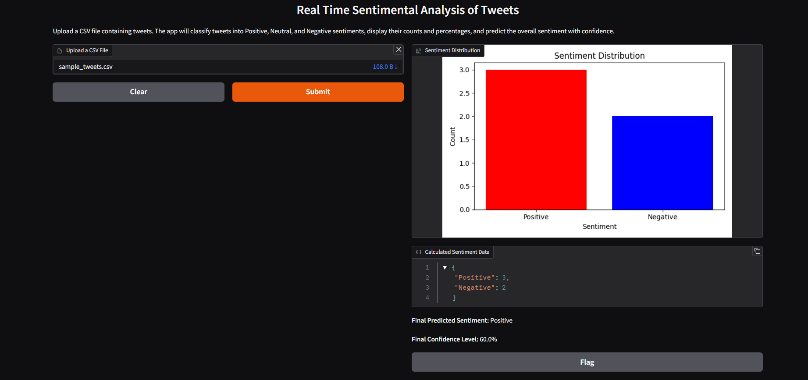

# 🐦 Twitter Sentiment Analysis – NLP Portfolio Project

**Author:** Utkarsh Tekriwal  
**Toolset:** Python | Hugging Face Transformers | Gradio | Pandas  

---

## 🔍 Project Overview

Turn raw Twitter data into real‑time sentiment insights. This project demonstrates how to ingest tweet text, preprocess it, run it through a fine‑tuned RoBERTa model, and expose the results via an interactive Gradio web interface.

---

## 📁 Input & Data

- **Sample CSV** (`data/sample_tweets.csv`)  
  - Column: `TweetText`  
  - Contains example tweets for quick testing  
- **CSV Upload**  
  - Any user‑provided CSV with a `TweetText` column can be analyzed live  

---

## 🛠️ Built With

- **Python 3.8+**  
- **Transformers** (`cardiffnlp/twitter-roberta-base-sentiment`) for sentiment classification  
- **Gradio** for web UI  
- **Pandas** for data handling  
- **Matplotlib** for simple bar charts  

---

## ⚙️ How It Works

1. **Load & Clean**  
   - Remove URLs, mentions, and emojis  
2. **Tokenize**  
   - Use the RoBERTa tokenizer to prepare inputs  
3. **Predict**  
   - Run through the fine‑tuned RoBERTa model  
   - Apply softmax to get probabilities for **Positive**, **Neutral**, **Negative**  
4. **Visualize**  
   - Render sentiment distribution bar chart  
   - Show JSON summary and top‑label with confidence  
5. **Interact**  
   - Users upload their own CSV via Gradio  
   - Results update instantly  

---

## 📊 Key Metrics & Insights

| Metric                   | Description                                  |
|--------------------------|----------------------------------------------|
| ✅ **Total Tweets**      | Number of tweets processed                   |
| 👍 **Positives**         | Count & percentage of positive tweets        |
| 🤝 **Neutrals**          | Count & percentage of neutral tweets         |
| 👎 **Negatives**         | Count & percentage of negative tweets        |
| 📈 **Distribution Chart**| Bar chart showing sentiment breakdown       |
| 🔍 **Top Example**       | Highest confidence prediction displayed      |

---

## 🖼️ App Preview



---

## 📂 Folder Structure

```
Twitter-Sentiment-Analysis/
├── assets/                    # App screenshots
│   └── app_screenshot.png
├── data/                      # Sample input CSV
│   └── sample_tweets.csv
├── src/                       # Application code
│   ├── sentiment_model.py     # Load & run the RoBERTa model
│   └── gradio_app.py          # Gradio UI entrypoint
├── notebooks/                 # Exploratory analysis (optional)
│   └── Twitter_Sentiment_Analysis.ipynb
├── requirements.txt           # Project dependencies
├── README.md                  # (You are here)
└── LICENSE                    # MIT License
```

---

## 🚀 Getting Started

1. **Clone the repo**  
   ```bash
   git clone https://github.com/utkarsh-tekriwal/Twitter-Sentiment-Analysis.git
   cd Twitter-Sentiment-Analysis
   ```

2. **Install dependencies**  
   ```bash
   pip install -r requirements.txt
   ```

3. **Run the app**  
   ```bash
   python src/gradio_app.py
   ```  
   - Opens `http://localhost:7860`  
   - Upload your own CSV and explore sentiment distributions  

---

## 💡 Why This Project Matters

- **Real‑World Relevance:** Brands and analysts rely on sentiment to gauge public opinion.  
- **State‑of‑the‑Art Model:** Leveraging a Transformer fine‑tuned on Twitter data ensures high accuracy.  
- **No‑Code UI:** Gradio makes deployment and sharing effortless.  
- **Extensible Design:** Swap in any Hugging Face model, add new visualizations, or integrate with other dashboards.  

---

## 📜 License

This project is licensed under the **MIT License**.
